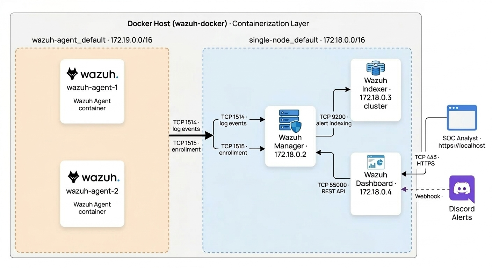

# 🛡️ **Wazuh on Docker** — End-to-End SOC Simulation

> ***A fully containerized Security Operations Center (SOC) lab using Docker and Wazuh. Deploy a real-world SIEM environment, monitor endpoints, simulate attacks, generate alerts and receive real-time Discord notifications — all running on a single machine.***

[](https://wazuh.com)
[](https://docker.com)
[](https://ubuntu.com)
[](https://discord.com)
[](LICENSE)

---

## 🎯 **What is this project?**

This project replicates a real enterprise SOC environment entirely on Docker — no physical hardware or cloud infrastructure required. It covers the full detection pipeline from agent log collection to real-time Discord alerts.

🔍 **Monitors** containerized endpoints with Wazuh agents  
⚠️ **Detects** threats using built-in and SOCFortress community rules  
📊 **Visualizes** alerts in the Wazuh Dashboard  
🔔 **Notifies** in real-time via Discord webhooks  
🧪 **Simulates** real-world attacks — brute force, privilege escalation, FIM, web attacks  
🐳 **Runs** entirely on Docker — no VMs, no cloud required

---

## 🏗️ **Architecture**



The lab runs two Docker networks. Wazuh agents live natively on `wazuh-agent_default` and are bridged into `single-node_default` via `docker network connect` to communicate with the Manager. The host machine runs `discord_notify.sh` to forward alerts to Discord and the SOC analyst accesses the dashboard through a browser at `https://localhost`.

**Port Reference:**

| Port | Protocol | Purpose |
|------|----------|---------|
| `1514` | TCP | Agent → Manager log events (ongoing communication) |
| `1515` | TCP | Agent → Manager enrollment (one-time key exchange) |
| `9200` | TCP | Manager → Indexer alert indexing (OpenSearch) |
| `55000` | TCP | Dashboard → Manager REST API |
| `443` | TCP | Browser → Dashboard HTTPS |

---

## ⚡ **Tech Stack**

| Component | Tool | Version |
|-----------|------|---------|
| SIEM Manager | Wazuh Manager | 4.14.3 |
| Log Storage | Wazuh Indexer (OpenSearch) | 4.14.3 |
| Dashboard | Wazuh Dashboard | 4.14.3 |
| Endpoint Agent | Wazuh Agent | 4.14.3 |
| Containerization | Docker + Docker Compose | Latest |
| Host OS | Ubuntu | 22.04+ |
| Detection Rules | SOCFortress Community Rules | Latest |
| Notifications | Discord Webhook | — |

---

## 🚀 **Phase 1 — Deploy Wazuh Stack**

### Step 1.1 — Install Docker

```bash
sudo apt update && sudo apt install -y docker.io docker-compose-plugin
sudo usermod -aG docker $USER && newgrp docker
docker run hello-world
```

### Step 1.2 — Clone Wazuh Docker Repository

```bash
mkdir -p ~/Wazuh && cd ~/Wazuh
git clone https://github.com/wazuh/wazuh-docker.git wazuh-docker
cd wazuh-docker/single-node
```

### Step 1.3 — Generate SSL Certificates

```bash
docker compose -f generate-indexer-certs.yml run --rm generator
```

### Step 1.4 — Start the Stack

```bash
docker compose up -d
docker ps
```

Expected containers:
```
single-node-wazuh.manager-1    → 172.18.0.2
single-node-wazuh.indexer-1    → 172.18.0.3
single-node-wazuh.dashboard-1  → 172.18.0.4
```

### Step 1.5 — Access Dashboard

```
URL:      https://localhost
Username: admin
Password: SecretPassword
```

### Step 1.6 — Verify Manager Services

```bash
docker exec -it single-node-wazuh.manager-1 /var/ossec/bin/wazuh-control status
```

---

## 🤖 **Phase 2 — Deploy Wazuh Agents**

The agent config is available in the official Wazuh Docker repository under `wazuh-docker/wazuh-agent/`. Two changes are required from the default config:

### Step 2.1 — Update `config/wazuh-agent-conf`

Change the server `address` & `port` in the `<server>` block:

```xml
<client>
  <server>
    <address>single-node-wazuh.manager-1</address>
    <port>1514</port>
    <protocol>tcp</protocol>
  </server>
  <enrollment>
    <enabled>yes</enabled>
    <manager_address>single-node-wazuh.manager-1</manager_address>
    <port>1515</port>
    <!-- <agent_name>docker-agent-1</agent_name> -->
    <!-- <authorization_pass_path>etc/authd.pass</authorization_pass_path> -->
    <groups>default</groups>
  </enrollment>
</client>
```

> `1515` is for enrollment only. `1514` is for all ongoing agent communication.

Add auth.log monitoring at the bottom of the config:

```xml
<localfile>
  <log_format>syslog</log_format>
  <location>/var/log/auth.log</location>
</localfile>
```

Enable realtime File Integrity Monitoring:

```xml
<directories realtime="yes">/etc,/usr/bin,/usr/sbin</directories>
<directories realtime="yes">/bin,/sbin,/boot</directories>
```

> Use `sed` to update the existing lines rather than replacing them:
```bash
sed -i 's|<directories>/etc,/usr/bin,/usr/sbin</directories>|<directories realtime="yes">/etc,/usr/bin,/usr/sbin</directories>|' config/wazuh-agent-conf
sed -i 's|<directories>/bin,/sbin,/boot</directories>|<directories realtime="yes">/bin,/sbin,/boot</directories>|' config/wazuh-agent-conf
```

### Step 2.2 — `docker-compose.yml` for Agent

Use hostname instead of hardcoded IP for the manager address:

```yaml
services:
  wazuh.agent:
    image: wazuh/wazuh-agent:4.14.3
    restart: always
    environment:
      - WAZUH_MANAGER_SERVER=single-node-wazuh.manager-1
    volumes:
      - ./config/wazuh-agent-conf:/wazuh-config-mount/etc/ossec.conf
```

### Step 2.3 — Start Agent Container

```bash
cd ~/Wazuh/wazuh-docker/wazuh-agent
docker compose up -d
```

---

## 🔗 **Phase 3 — Connect Agent to Manager**

Agents start on `wazuh-agent_default` (172.19.0.0/16) by default. The manager runs on `single-node_default` (172.18.0.0/16). We manually bridge them.

### Step 3.1 — Register Agent in Manager

```bash
docker exec -it single-node-wazuh.manager-1 /var/ossec/bin/manage_agents
```

- Press `A` → Name: `docker-agent-1`, IP: `any` → Confirm `y`
- Press `E` → ID: `001` → **Copy the full base64 key**
- Press `Q` → Quit

### Step 3.2 — Connect Agent to Manager's Network

```bash
docker network connect single-node_default wazuh-agent-wazuh.agent-1
```

### Step 3.3 — Import Key into Agent

```bash
docker exec -it wazuh-agent-wazuh.agent-1 /var/ossec/bin/manage_agents
# Press I → Paste base64 key → Confirm y
```

### Step 3.4 — Restart Agent and Verify

```bash
docker restart wazuh-agent-wazuh.agent-1

# Watch logs for confirmation
docker exec -it wazuh-agent-wazuh.agent-1 tail -f /var/ossec/logs/ossec.log
# Expected: INFO: Connected to the server ([single-node-wazuh.manager-1]:1514/tcp)

# Verify in manager
docker exec -it single-node-wazuh.manager-1 /var/ossec/bin/agent_control -l
# Expected: ID: 001, Name: docker-agent-1, IP: any, Active
```

---

## 📏 **Phase 4 — Scale to Multiple Agents**

### Step 4.1 — Register Agent 2 in Manager

```bash
docker exec -it single-node-wazuh.manager-1 /var/ossec/bin/manage_agents
# A → Name: docker-agent-2, IP: any, ID: 002
# E → Extract key for 002 → Copy it
```

### Step 4.2 — Scale Agent Container

```bash
# --scale wazuh.agent=2 means 2 total instances, not 2 additional
cd ~/Wazuh/wazuh-docker/wazuh-agent
docker compose up -d --scale wazuh.agent=2

# Connect agent-2 to manager's network
docker network connect single-node_default wazuh-agent-wazuh.agent-2
```

### Step 4.3 — Import Key and Verify

```bash
docker exec -it wazuh-agent-wazuh.agent-2 /var/ossec/bin/manage_agents
# I → Paste key for 002 → Confirm y

docker restart wazuh-agent-wazuh.agent-2

docker exec -it single-node-wazuh.manager-1 /var/ossec/bin/agent_control -l
# Expected:
# ID: 001, Name: docker-agent-1, IP: any, Active
# ID: 002, Name: docker-agent-2, IP: any, Active
```

> **Duplicate agent name warning** — since both containers share the same config file, the `<agent_name>` tag causes a conflict. We comment it out so each container auto-generates a unique name from its hostname:
```bash
sed -i 's/<agent_name>.*<\/agent_name>/<!-- <agent_name>docker-agent-1<\/agent_name> -->/' \
  ~/Wazuh/wazuh-docker/wazuh-agent/config/wazuh-agent-conf
```

---

## 📦 **Phase 5 — Install SOCFortress Detection Rules**

Community rules from [SOCFortress](https://github.com/socfortress/Wazuh-Rules) — Auditd, Suricata and Modsecurity.

```bash
cd ~/Wazuh
git clone https://github.com/socfortress/Wazuh-Rules.git

# Copy rules into manager
docker cp ~/Wazuh/Wazuh-Rules/Auditd/. single-node-wazuh.manager-1:/var/ossec/etc/rules/
docker cp ~/Wazuh/Wazuh-Rules/Suricata/. single-node-wazuh.manager-1:/var/ossec/etc/rules/
docker cp ~/Wazuh/Wazuh-Rules/Modsecurity/. single-node-wazuh.manager-1:/var/ossec/etc/rules/

# Fix decoder placement — must be in decoders/, not rules/
docker exec -it single-node-wazuh.manager-1 rm -f /var/ossec/etc/rules/auditd_decoders.xml
docker cp ~/Wazuh/Wazuh-Rules/Auditd/auditd_decoders.xml \
  single-node-wazuh.manager-1:/var/ossec/etc/decoders/auditd_decoders.xml

# Copy required list file
docker cp ~/Wazuh/Wazuh-Rules/Auditd/bash_profile \
  single-node-wazuh.manager-1:/var/ossec/etc/lists/bash_profile

# Restart manager to load rules
docker exec -it single-node-wazuh.manager-1 /var/ossec/bin/wazuh-control restart

# Verify — no CRITICAL errors expected
docker exec -it single-node-wazuh.manager-1 grep -i "critical" /var/ossec/logs/ossec.log | tail -5
```

---

## 🔴 **Phase 6 — Attack Simulations**

> Open two terminals — one to watch alerts, one to run attacks.

**Terminal 1 — Watch alerts live:**
```bash
docker exec -it single-node-wazuh.manager-1 tail -f /var/ossec/logs/alerts/alerts.log
```

---

### Attack 1 — SSH Invalid User Login
**Rule:** `5710 (Level 5)` — Attempt to login using a non-existent user
```bash
docker exec -it wazuh-agent-wazuh.agent-1 bash -c \
  "echo \"$(date +'%b %d %H:%M:%S') $(hostname) sshd[1234]: Failed password for invalid user admin from <ATTACKER_IP> port 22 ssh2\" >> /var/log/auth.log"
```

### Attack 2 — SSH Brute Force
**Rule:** `5712 (Level 10)` — Brute force trying to get access to the system
```bash
docker exec -it wazuh-agent-wazuh.agent-1 bash -c \
  "for i in {1..15}; do echo \"$(date +'%b %d %H:%M:%S') $(hostname) sshd[1234]: Failed password for invalid user admin from <ATTACKER_IP> port 22 ssh2\" >> /var/log/auth.log; done"
```

### Attack 3 — Privilege Escalation
**Rule:** `5405 (Level 5)` — Unauthorized user attempted to use sudo
```bash
docker exec -it wazuh-agent-wazuh.agent-1 bash -c \
  "for i in {1..5}; do echo \"$(date +'%b %d %H:%M:%S') $(hostname) sudo: hacker : user NOT in sudoers ; TTY=pts/0 ; PWD=/root ; USER=root ; COMMAND=/bin/bash\" >> /var/log/auth.log; done"
```

### Attack 4 — File Integrity Monitoring
**Rule:** `550 (Level 7)` — Integrity checksum changed (realtime)
```bash
docker exec -it wazuh-agent-wazuh.agent-1 bash -c \
  "echo 'backdoor:x:0:0:root:/root:/bin/bash' >> /etc/passwd"
```

### Attack 5 — Web Attack (SQL Injection)
**Rule:** `Modsecurity detection`
```bash
docker exec -it wazuh-agent-wazuh.agent-1 bash -c \
  "echo \"$(date +'%b %d %H:%M:%S') $(hostname) modsec: Access denied with code 403. Pattern match UNION SELECT at REQUEST_URI. SQL Injection Attack Detected from <ATTACKER_IP>\" >> /var/log/auth.log"
```

---

**Alert Summary:**

| # | Attack | Rule | Level | Compliance |
|---|--------|------|-------|------------|
| 1 | SSH Invalid User | 5710 | 5 🟡 | PCI-DSS, GDPR, HIPAA, NIST |
| 2 | SSH Brute Force | 5712 | 10 🔴 | PCI-DSS, GDPR, HIPAA, NIST |
| 3 | Privilege Escalation | 5405 | 5 🟡 | PCI-DSS, GDPR, HIPAA, NIST |
| 4 | FIM — /etc/passwd | 550 | 7 🟠 | PCI-DSS, GDPR, HIPAA, NIST |
| 5 | SQL Injection | Modsec | 7 🟠 | PCI-DSS, GDPR |

---

## 🔔 **Phase 7 — Discord Notifications**

> The Wazuh Manager container has no outbound internet access. The notification script runs on the **host machine**, watching the alert log and forwarding to Discord.

### Step 7.1 — Create Discord Webhook

1. Open Discord → server → `#wazuh-alerts` channel
2. Edit Channel → Integrations → Webhooks → New Webhook
3. Name it `Wazuh SOC Lab` → Copy Webhook URL

### Step 7.2 — Create Notification Script

```bash
mkdir -p ~/Wazuh/discord-notify
cat > ~/Wazuh/discord-notify/discord_notify.sh << 'EOF'
#!/bin/bash
WEBHOOK_URL="YOUR_DISCORD_WEBHOOK_URL_HERE"

echo "Wazuh Discord Notifier started..."
docker exec single-node-wazuh.manager-1 tail -f /var/ossec/logs/alerts/alerts.log | while read line; do
    if echo "$line" | grep -q "level 10)"; then
        curl -s -X POST "$WEBHOOK_URL" -H "Content-Type: application/json" \
        -d "{\"embeds\": [{\"title\": \"🔴 CRITICAL — Level 10\", \"description\": \"$line\", \"color\": 16711680}]}"
    elif echo "$line" | grep -qE "level [789]\)"; then
        curl -s -X POST "$WEBHOOK_URL" -H "Content-Type: application/json" \
        -d "{\"embeds\": [{\"title\": \"🟠 HIGH — Level 7+\", \"description\": \"$line\", \"color\": 16744272}]}"
    elif echo "$line" | grep -qE "level [56]\)"; then
        curl -s -X POST "$WEBHOOK_URL" -H "Content-Type: application/json" \
        -d "{\"embeds\": [{\"title\": \"🟡 MEDIUM — Level 5+\", \"description\": \"$line\", \"color\": 16776960}]}"
    fi
done
EOF
chmod +x ~/Wazuh/discord-notify/discord_notify.sh
```

### Step 7.3 — Set Webhook URL and Run

```bash
# Set your webhook URL
sed -i 's|YOUR_DISCORD_WEBHOOK_URL_HERE|https://discord.com/api/webhooks/YOUR_ID/YOUR_TOKEN|' \
  ~/Wazuh/discord-notify/discord_notify.sh

# Test it first
curl -s -X POST "YOUR_WEBHOOK_URL" \
  -H "Content-Type: application/json" \
  -d '{"embeds": [{"title": "✅ Wazuh Test", "description": "Discord integration working!", "color": 65280}]}'

# Run in background using screen
screen -S wazuh-discord
~/Wazuh/discord-notify/discord_notify.sh
# Ctrl+A then D to detach — notifier keeps running
```

> ⚠️ The script must be running to receive notifications. Reattach anytime with `screen -r wazuh-discord`.

---

## 🔧 **Troubleshooting**

### Agent shows "Never Connected"
```bash
# Check which networks both containers are on
docker network inspect single-node_default | grep -A5 "Containers"
docker network inspect wazuh-agent_default | grep -A5 "Containers"

# Bridge agent into manager's network
docker network connect single-node_default wazuh-agent-wazuh.agent-1
```

### Manager services not running
```bash
docker exec -it single-node-wazuh.manager-1 /var/ossec/bin/wazuh-control start
docker exec -it single-node-wazuh.manager-1 /var/ossec/bin/wazuh-control status
```

### Enrollment fails — "Invalid request"
```bash
# Clean and reset client.keys on manager
docker exec -it single-node-wazuh.manager-1 bash -c \
  "rm -f /var/ossec/etc/client.keys && touch /var/ossec/etc/client.keys && \
   chown root:wazuh /var/ossec/etc/client.keys && chmod 640 /var/ossec/etc/client.keys"

# Clean client.keys on agent
docker exec -it wazuh-agent-wazuh.agent-1 bash -c "rm -f /var/ossec/etc/client.keys"
# Re-register agent and import fresh key
```

### Port 1514 connection refused
```bash
# Test from inside agent container
docker exec -it wazuh-agent-wazuh.agent-1 bash -c \
  "cat < /dev/null > /dev/tcp/172.18.0.2/1514 && echo 'PORT OPEN' || echo 'PORT CLOSED'"

# Confirm wazuh-remoted is running on manager
docker exec -it single-node-wazuh.manager-1 /var/ossec/bin/wazuh-control status | grep remoted
```

### Rules not loading after restart
```bash
# Check for critical errors
docker exec -it single-node-wazuh.manager-1 grep -i "critical" /var/ossec/logs/ossec.log | tail -10

# Common fix — decoder in wrong folder
docker exec -it single-node-wazuh.manager-1 ls /var/ossec/etc/decoders/
# auditd_decoders.xml must be here, NOT in /etc/rules/
```

### Alerts not triggering for attack simulations
```bash
# Verify log file is monitored
docker exec -it wazuh-agent-wazuh.agent-1 grep -i "auth.log" /var/ossec/logs/ossec.log

# Logs must use proper syslog format — timestamp + hostname is required
docker exec -it wazuh-agent-wazuh.agent-1 bash -c \
  "echo \"$(date +'%b %d %H:%M:%S') $(hostname) sshd[1234]: test message\" >> /var/log/auth.log"
```

---

## 🔗 **References**

- [Wazuh Official Documentation](https://documentation.wazuh.com)
- [Wazuh Docker Repository](https://github.com/wazuh/wazuh-docker)
- [SOCFortress Wazuh Rules](https://github.com/socfortress/Wazuh-Rules)
- [Discord Webhook Documentation](https://discord.com/developers/docs/resources/webhook)

---

## 📝 **License**

This project is licensed under the **MIT License** — see [LICENSE](LICENSE) for details.

---

## 👨‍💻 **Author**

**Charan**  
🔗 [GitHub](https://github.com/charan-s108) | 💼 [LinkedIn](https://linkedin.com/in/charan-s108) | 📧 charansrinivas108@gmail.com

---

### 🎉 **Built with ❤️ for the Cybersecurity Community**

[](https://github.com/charan-s108/WazuhLab)

⭐ If this helped you, consider giving it a star!
